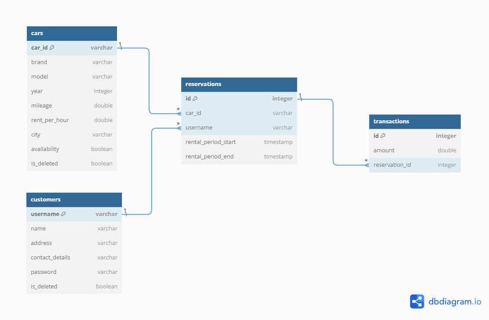

# Car Rental System - README

## Overview
This Car Rental System is a Java-based application that allows customers to search for available cars, make reservations, modify and cancel existing reservations, and view their reservation history. Additionally, it provides admin functionalities such as managing cars, customers, and generating reports on car usage and revenue.

## Prerequisites
* Java Development Kit (JDK) 8 or higher.
* Java IDE (Eclipse, IntelliJ, etc.).
* MySQL database server.
## Database Configuration
1. Set up your MySQL database server.
2. Create a new database named cars using the following SQL    command:
#### sql -> (CREATE DATABASE cars;)
3. Ensure that the database server is running.
## Project Structure
The project consists of the following packages:

* `com.rental.main:` Contains the `Main` class with the main method to run the application.
* `com.rental.main.entities:` Contains entity classes representing the core data models of the system, such as Car, Customer, Reservation, and Transaction.
* `com.rental.main.DAO:` Contains Data Access Object (DAO) classes responsible for interacting with the database and executing queries.
* `com.rental.main.services:` Contains service classes that provide the main functionalities for customers and administrators.
* `com.rental.main.exceptions:` Contains custom exception classes used to handle specific scenarios in the application.
* `com.rental.main.Util:` Contains utility classes, such as DbUtils, for database connection and entity management.
## Running the Application
1. Clone the project repository to your local machine.
2. Open the project in your Java IDE.
3. Configure the database connection properties in the **persistence.xml** file inside the **META-INF** folder to match your MySQL database setup.
Run the `com.rental.main.Main` class to start the application.
## Customer Functionalities
* **Customer Registration:** Customers can create new accounts with unique usernames.
* **Customer Login:** Existing customers can log in to their accounts using their username and password.
* **Search Cars:** Customers can search for available cars based on rental and mileage ranges.
* **Make Reservation:** Customers can reserve a car for a specific rental period.
* **View Reservations:** Customers can view their existing reservations.
* **Modify Reservation:** Customers can modify their reservations, such as changing rental dates or rental hours.
* **Cancel Reservation:** Customers can cancel their reservations.
## Admin Functionalities
* **View Customers:** Administrators can view the list of all customers registered in the system.
* **View Cars:** Administrators can view the list of all cars in the system.
Add Car: Administrators can add new cars to the system.
* **Update Car:** Administrators can update car details.
* **Delete Car:** Administrators can soft delete car details (marked as deleted in the database).
* **Generate Car Report:** Administrators can generate reports on car usage and revenue.
* **Add Back Car:** Administrators can restore cars that were marked as deleted.
* **Delete Customer:** Administrators can soft delete customer details (marked as deleted in the database).

## ER Diagram

You can find the Entity Relationship (ER) diagram for the Car Rental System below:

The diagram represents the relationships and structure of the database entities used in the Car Rental System application.

